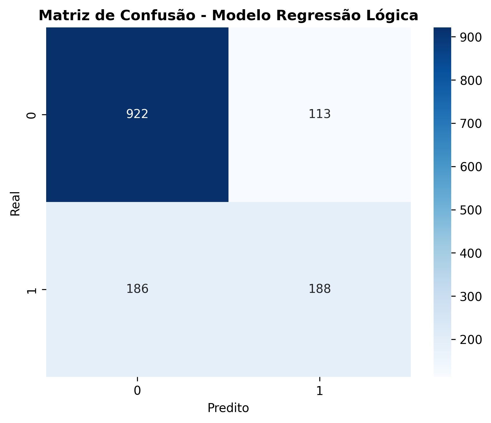

Predição de Churn - Telecom X
Objetivo:
Construção de um modelo de machine learning para prever clientes com alta probabilidade de churn, permitindo ações proativas de retenção e otimização de estratégias comerciais.

Resumo Executivo

Melhor modelo: Regressão Logística
Performance: AUC = 83.8% | Precisão = 62.5% | Recall = 50.3%
Impacto esperado: redução de 15–25% no churn e aumento de 10–15% no LTV
ROI: positivo em 3–6 meses

### Matriz de confusão do Modelo de Regressão

 Metodologia

EDA – análise de distribuições, padrões e correlações.
Pré-processamento – limpeza, encoding, normalização (StandardScaler) e seleção de features.
Modelagem – testes com Regressão Logística e Random Forest, avaliados por cross-validation.
Avaliação – métricas (AUC, F1, precisão, recall), curva ROC/PR, matriz de confusão e análise de features.

Principais Insights

Contratos mensais → maior risco de churn.
Clientes recentes (tenure baixo) → mais propensos a cancelar.
Ausência de OnlineSecurity, TechSupport e OnlineBackup aumenta risco.

Recomendações Estratégicas

Retenção proativa: scoring em tempo real + campanhas personalizadas.
Incentivos a contratos anuais e programas de fidelidade.
Onboarding estruturado nos 6 primeiros meses.
Segmentação por risco para personalização de ações.
Política de preços dinâmica para clientes de alto risco.

 Impacto Esperado

Quantitativo: redução de 15–25% no churn | aumento de 10–15% no LTV | ROI positivo em até 6 meses.
Qualitativo: maior satisfação, decisões data-driven, vantagem competitiva.

Feito por Caio Hernandes
